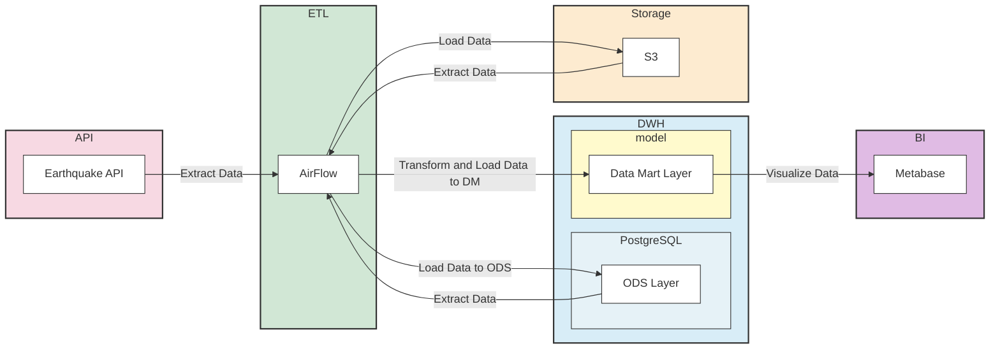

# Data Governance

### [Назад  ⤶](/README.md)

> _**Data Governance**_ — набор процессов для эффективного управления данными.

1. Архитектура данных (Data Architecture)
2. Моделирование данных и дизайн (Data Modeling & Design)
3. Хранение данных и вычисления (Data Storage & Operations)
4. Безопасность данных (Data Security)
5. Интеграция данных и совместимость (Data Integration & Interoperability)
6. Документация и контент (Documents & Content)
7. Справочные и основные данные (Reference & Master Data)
8. Хранение данных и бизнес-аналитика (Data Warehousing & Business Intelligence)
9. Метаданные (Meta-data)
10. Качество данных (Data Quality)
___  

## 1. Архитектура данных (Data Architecture)
В качестве архитектурного решения будем использовать современный (на 2025 год) подход, называемый *Lakehouse*.

> ***Lakehouse*** — это гибридная платформа, объединяющая преимущества _Data Lake_ (хранилище неструктурированных данных) 
> и _Data Warehouse_ (хранилище данных для аналитики).

### Как это работает
У нас есть **API** Землетрясений, с помощью _python_-скрипта мы извлекаем данные. Оркестрируем все движения данных при 
помощи _Airflow_ (**ETL/ELT** процессы).  

Данные будут перекладываться в **Storage**, хранение будет в _S3 MinIO_. В _S3_ мы будем как загружать данные, так 
и выгружать оттуда для дальнейшей трансформации.  

В Хранилище данных (**DWH**) у нас будут храниться актуальные данные, которые мы сможем использовать в своей аналитике. 
**DWH** имеет два слоя — _ODS_ и _DM_.

> _**ODS Layer** (Operational Data Store)_ — это слой для сбора, хранения и обработки данных из различных операционных систем.  
> Служит промежуточным хранилищем между операционными системами и аналитическими хранилищами данных.

> _**DM Layer** (Data Mart)_ — это слой витрин данных.  
> Преобразует данные для анализа и использования в BI-дашбордах и других BI-системах.

Построим витрины, которые будут визуализироваться в BI-инструменте **MetaBase**.

## 2. Моделирование данных и дизайн (Data Modeling & Design)
В данном проекте не будет моделирования — не применяется схема «Звезда», «Снежинка» или другое, потому что в этом нет 
необходимости. Данных немного и состояние измениться не может, поэтому создаём модель по типу "Как есть" (_"AS IS"_). 
Данные получили из источника (**API**) и сразу же положили их в _S3_ и с небольшими трансформациями переложили в **DWH** 
для дальнейших манипуляций.

## 3. Хранение данных и вычисления (Data Storage & Operations)
### Хранение (Storage)

| _Type_           | _Service_  |
|:-----------------|:-----------|
| **Cold Storage** | S3         |
| **Warm Storage** | S3         |
| **Hot Storage**  | PostgreSQL |

### Вычисления (Compute)

| _Type_        | _Service_  |
|:--------------|:-----------|
| **Data Lake** | duckDB     |
| **DM Layer**  | PostgreSQL |

## 4. Безопасность данных (Data Security)
Безопасность в нашем проекте будет осуществляться настройкой на уровне пользователей в _S3_ и ролевой модели в 
_PostgreSQL_. В _Airflow_ безопасность будет задаваться через роли.

## 5. Интеграция данных и совместимость (Data Integration & Interoperability)
В текущей реализации проекта работа по совместимости не произведена (все работает).
Но для "правильной" работы необходимо "приводить" данные к нужным типам в **ODS** слое.  

Например:
`time varchar` к `time timestamp`

## 6. Документация и контент (Documents & Content)
Документация с комментариями будут в части **Создание проекта**.